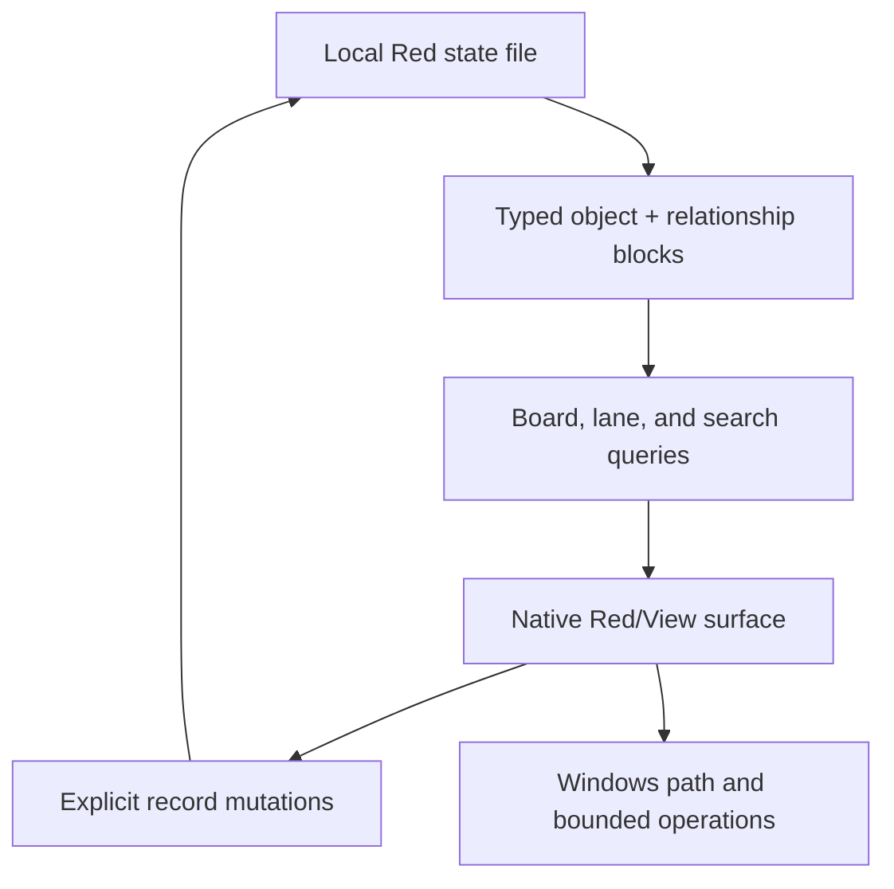

# Red Architecture

## Runtime shape

## Active decisions

| Concern | v0.1 decision | Reason |
| --- | --- | --- |
| GUI | Red/View | Native, compact, and directly aligned with the rewrite goal |
| Storage | Schema-v1 named Red state block with typed payload property blocks | Transparent and dependency-free |
| System of record | `data/ops-state.red` | Recoverable local state separate from source |
| Board | Query projection | Attention never determines object existence |
| Relationships | Independent blocks | Enables impact queries without card coupling |
| Path launch | Windows Explorer | Useful transition without replacing specialist tools |
| Old scaffold | Historical archive | Recoverable but non-authoritative |

## Data Contract

The first shell uses a shared fixed-position envelope documented next to the field constants in `src/ops-control.red`. Field 14 is a type-specific payload property block. Older 13-field records are normalized in memory by adding the appropriate payload defaults for their object type.

The state container is a named Red property block with `schema-version`, `objects`, and `relationships`. The loader accepts the legacy two-block container as schema v0. Before the first migrated save, the original bytes must be written successfully to `data/ops-state.red.v0.bak`; a backup failure stops the save. Loading and saving validate object shape, known object type, payload field order and value types, unique IDs, relationship shape, and complete relationship endpoints.

The common envelope remains:

- identity: id, type, name, acronym, summary
- operational state: board, lane, attention, pinned, updated date
- location: path or target
- operator-authored tags and notes
- payload: compact type-specific operational fields

The six payload templates are:

- `project`: version, numeric completion, phase, next action, blocker, manifest, repository.
- `powershell-operator`: script, entry point, working directory, privilege, mutation level, preview support, confirmation, timeout, parameters.
- `city-hall`: authority class, version, scope, canonical source.
- `stock`: stock class, format, source, version, provenance, verified state, intended use.
- `artifact`: artifact class, format, version, production time, size, canonical/published/verified state, hashes.
- `ai-workflow`: trigger, autonomy, write scope, approval boundary, stop condition, steps.

New records begin as inspector drafts. They are not added to the stored object list until Save, and Save requires an explicit type selection.

Type selection is authoritative. The inspector keeps the persisted object type separate from the proposed selected type: changing the selected type immediately renders the new type's default payload, but the stored object is unchanged until Save. Saving with the same type parses and stores the edited payload block. Saving with a changed type discards the old typed payload and replaces it with the selected type's default payload while preserving shared envelope fields and relationships.

Relationship creation is restricted to the canonical relationship vocabulary from the authoritative object model: `governs`, `implements`, `contains`, `depends-on`, `produces`, `produced-by`, `consumes`, `used-by`, `operates-on`, `executed-by`, `invokes`, `part-of`, `references`, `supersedes`, `derived-from`, and `validates`.

Before payload breadth expands materially, continue with:

1. migration smoke coverage against copied state fixtures;
2. named common-envelope records before fixed-position fields expand;
3. richer validation for controlled payload values;
4. visible recovery controls for restoring a migration backup.

## Operations contract

Executable operations must eventually record and display:

- executable or script path
- arguments or parameters
- working directory
- elevation requirement
- mutation classification
- expected output
- confirmation requirement
- last run and result

The shell may open recorded paths now. It must not gain arbitrary or silent execution as an incidental shortcut.
