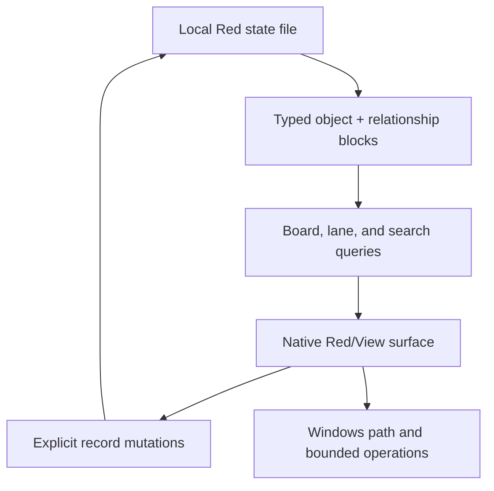

# Red Architecture

## Runtime shape

## Active decisions

| Concern | v0.1 decision | Reason |
| --- | --- | --- |
| GUI | Red/View | Native, compact, and directly aligned with the rewrite goal |
| Storage | Nested Red blocks | Transparent and dependency-free |
| System of record | `data/ops-state.red` | Recoverable local state separate from source |
| Board | Query projection | Attention never determines object existence |
| Relationships | Independent blocks | Enables impact queries without card coupling |
| Path launch | Windows Explorer | Useful transition without replacing specialist tools |
| Old scaffold | Historical archive | Recoverable but non-authoritative |

## Data contract

The first shell intentionally uses a small fixed-position record documented next to the field constants in `src/ops-control.red`. This is appropriate only while the common model remains compact.

Before type-specific payloads are implemented, introduce:

1. a state schema/version header;
2. named typed records or validated property blocks;
3. migration functions from the v0.1 positional representation;
4. backup-before-migration behavior;
5. validation that rejects incomplete relationship endpoints.

## Operations contract

Executable operations must eventually record and display:

- executable or script path
- arguments or parameters
- working directory
- elevation requirement
- mutation classification
- expected output
- confirmation requirement
- last run and result

The shell may open recorded paths now. It must not gain arbitrary or silent execution as an incidental shortcut.

