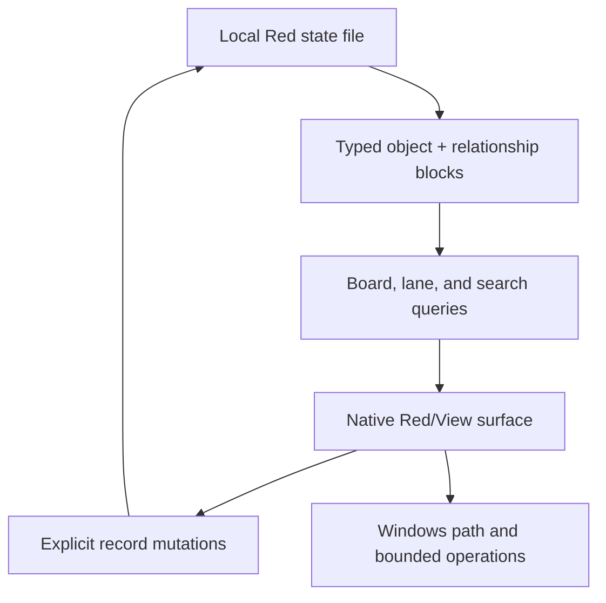

# Red Architecture

## Runtime shape

## Active decisions

| Concern | v0.1 decision | Reason |
| --- | --- | --- |
| GUI | Red/View | Native, compact, and directly aligned with the rewrite goal |
| Storage | Nested Red blocks with typed payload property blocks | Transparent and dependency-free |
| System of record | `data/ops-state.red` | Recoverable local state separate from source |
| Board | Query projection | Attention never determines object existence |
| Relationships | Independent blocks | Enables impact queries without card coupling |
| Path launch | Windows Explorer | Useful transition without replacing specialist tools |
| Old scaffold | Historical archive | Recoverable but non-authoritative |

## Data Contract

The first shell uses a shared fixed-position envelope documented next to the field constants in `src/ops-control.red`. Field 14 is a type-specific payload property block. Older 13-field records are normalized in memory by adding the appropriate payload defaults for their object type.

The common envelope remains:

- identity: id, type, name, acronym, summary
- operational state: board, lane, attention, pinned, updated date
- location: path or target
- operator-authored tags and notes
- payload: compact type-specific operational fields

The six payload templates are:

- `project`: version, completion, phase, next action, blocker, manifest, repository.
- `powershell-operator`: script, entry point, working directory, privilege, mutation level, preview support, confirmation, timeout, parameters.
- `city-hall`: authority class, version, scope, canonical source, compliance target, evidence.
- `stock`: stock class, format, source, version, provenance, verified state, intended use.
- `artifact`: artifact class, format, version, production time, size, canonical/published/verified state, hashes.
- `ai-workflow`: trigger, autonomy, write scope, approval boundary, stop condition, steps.

New records infer an initial type from their lane where the lane is type-specific: City Hall creates `city-hall`, Stock creates `stock`, Operators creates `powershell-operator`, and project lanes create `project`. Secondary work lanes default to `project` until a more specific workflow is chosen.

Relationship creation is guided by the canonical relationship vocabulary from the data-shape model: `governs`, `implements`, `contains`, `depends-on`, `produces`, `produced-by`, `consumes`, `used-by`, `operates-on`, `executed-by`, `invokes`, `part-of`, `references`, `supersedes`, `derived-from`, and `validates`.

Before payload breadth expands materially, introduce:

1. a state schema/version header;
2. named records or stricter payload validation;
3. backup-before-migration behavior;
4. validation that rejects incomplete relationship endpoints.

## Operations contract

Executable operations must eventually record and display:

- executable or script path
- arguments or parameters
- working directory
- elevation requirement
- mutation classification
- expected output
- confirmation requirement
- last run and result

The shell may open recorded paths now. It must not gain arbitrary or silent execution as an incidental shortcut.
